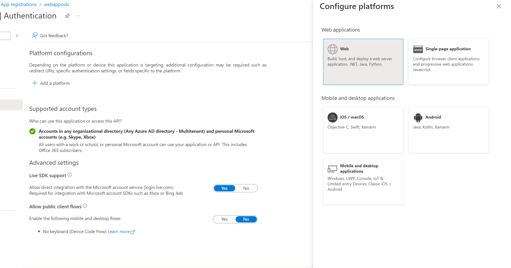
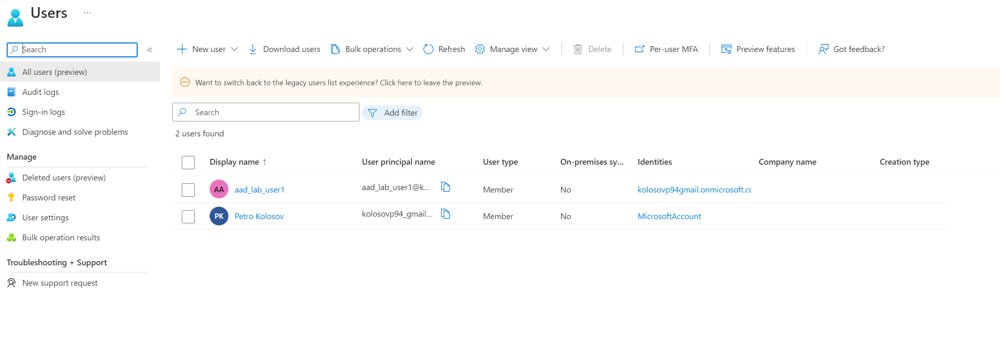
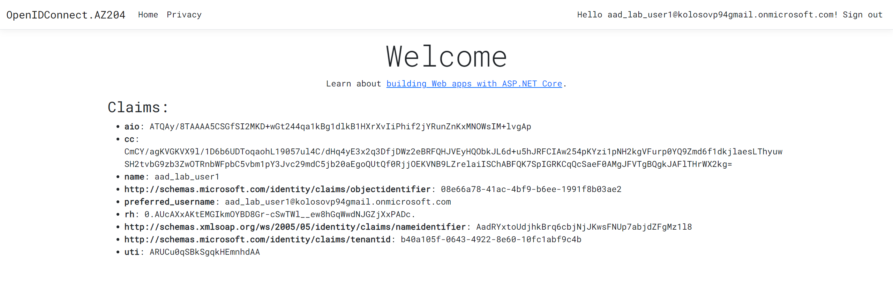
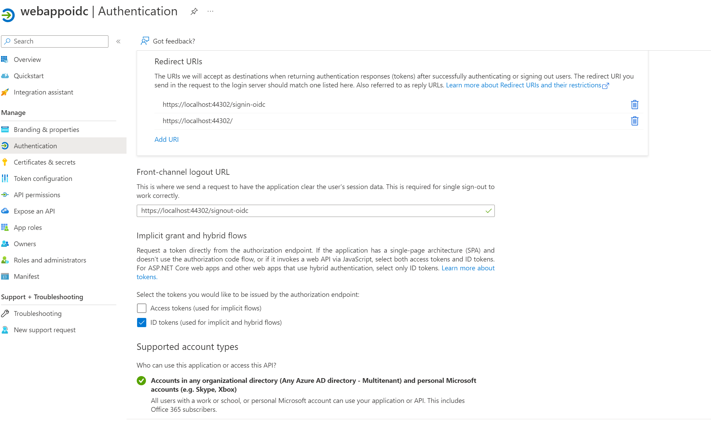
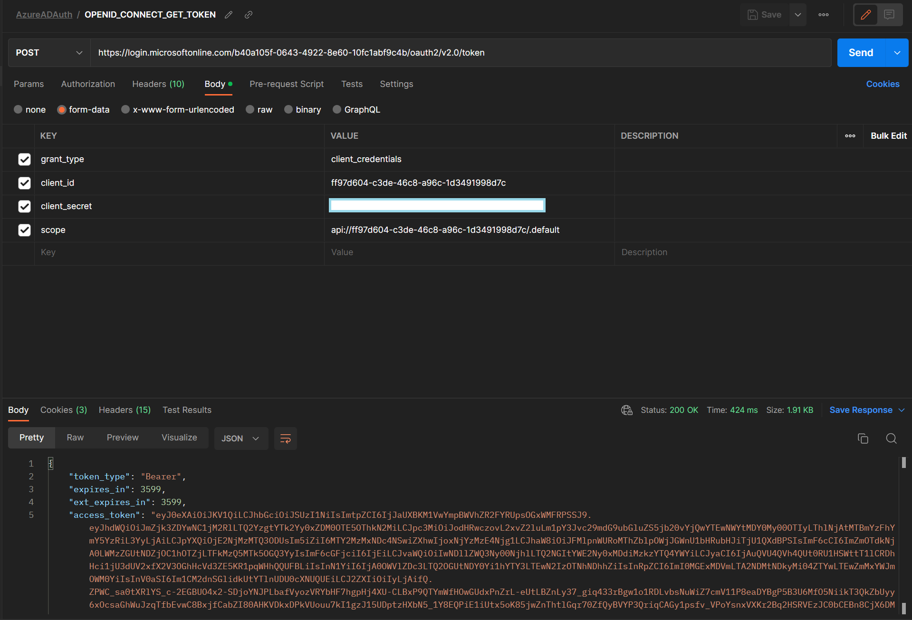

# OpenIDConnect Demo

Single and Multi tenant authorization using ASP NET Core and Active Directory

## Infrastructure provision

- Create resource group: `az group create --name "rg-open-id-connect" --location "centralus"`
- Create AD app registration: `az ad app create --display-name "webappoidc"`
- Get Application (client) ID from Azure portal: `d9334586-4f28-4277-9358-18d6bc025638`
- Get Directory (tenant) ID from Azure portal: `b40a105f-0643-4922-8e60-10fc1abf9c4b`

## Update Authentication blade inside app registration

Set the following parameters inside Authentication blade,
Click "Add platform" of type "Web"

And enter the following values:

- Redirect URI: `https://localhost:44302/signin-oidc`
- Front-channel logout URL: `https://localhost:44302/signout-oidc`
- ID Tokens (used for implicit and hybrid flows): `Checked`

As per screenshot below

## Create AD User via Azure Powershell

**Requires:**

- Update Windows Powershell as Administrator using: `Install-Module PSWindowsUpdate`
- Install [Azure PowerShell](https://docs.microsoft.com/en-us/powershell/azure/install-az-ps)
- Install as Powershell Administrator: `Install-Module AzureAD`

**Create User**

- Connect to AD: `Connect-AzureAD -TenantId "b40a105f-0643-4922-8e60-10fc1abf9c4b"`
- Define AD domain variable: `$aadDomainName = ((Get-AzureAdTenantDetail).VerifiedDomains)[0].Name`
- Create password profile:
    - `$passwordProfile = New-Object -TypeName Microsoft.Open.AzureAD.Model.PasswordProfile`
    - `$passwordProfile.Password = 'Pa55w.rd1234'`
    - `$passwordProfile.ForceChangePasswordNextLogin = $false`
- Create new
  user: `New-AzureADUser -AccountEnabled $true -DisplayName 'aad_lab_user1' -PasswordProfile $passwordProfile -MailNickName 'aad_lab_user1' -UserPrincipalName "aad_lab_user1@$aadDomainName"`
- Print new user principal name: `(Get-AzureADUser -Filter "MailNickName eq 'aad_lab_user1'").UserPrincipalName`
- UPN: `aad_lab_user1@kolosovp94gmail.onmicrosoft.com`

## Create ASP NET Core MVC application

- Connect to AD: `Connect-AzureAD -TenantId "b40a105f-0643-4922-8e60-10fc1abf9c4b"`
- Define AD domain variable: `$aadDomainName = ((Get-AzureAdTenantDetail).VerifiedDomains)[0].Name`
- Create application using client ID and tenant ID:
  `dotnet new mvc --auth SingleOrg --client-id "d9334586-4f28-4277-9358-18d6bc025638" --tenant-id "b40a105f-0643-4922-8e60-10fc1abf9c4b" --domain $aadDomainName`
- Update nuget packages:
    - `Microsoft.AspNetCore.Authentication.JwtBearer`
    - `Microsoft.AspNetCore.Authentication.OpenIdConnect`
    - `Microsoft.Identity.Web`
    - `Microsoft.Identity.Web.UI`

## Test your MVC application

From my prospective it is as follows

## Configure a multi-tenant Azure AD environment

**Create an Azure AD tenant**

- In the Azure portal, navigate to the **Azure Active Directory** blade.

- On the **Azure Active Directory** blade, select **Manage tenants**, and then select **+ Create**.

- On the **Basics** tab of the **Create a tenant** blade, ensure that the **Azure Active Directory** option is
  selected, and then select **Next: Configuration >**.

- On the **Configuration** tab of the **Create a tenant** blade, specify the following settings:
    - Organization name: `Contoso`
    - Initial domain name: `contosopkolosov`
    - Country/Region: `Poland`

- Select **Review + create**, and then select **Create**.

- If prompted, on the **Help us prove you're not a robot**, enter the provided code, and then select **Submit**.

- Wait for the provisioning to complete, and then select the **Contoso** link to navigate to the blade that displays
  properties of the Contoso Azure AD tenant.

- On the **Overview** blade of the Azure AD tenant, identify and record the value of its **Tenant ID** property. You'll
  use this value later in the lab.

- Contoso Tenant ID: `f6009e3f-a3f3-40cd-8fe7-afb972534c91`

## Create an Azure AD user

- Connect to AD using Az Powershell: `Connect-AzureAD -TenantId "f6009e3f-a3f3-40cd-8fe7-afb972534c91"`
- Define AD domain variable: `$aadDomainName = ((Get-AzureAdTenantDetail).VerifiedDomains)[0].Name`
- Create password profile:
    - `$passwordProfile = New-Object -TypeName Microsoft.Open.AzureAD.Model.PasswordProfile`
    - `$passwordProfile.Password = 'Pa55w.rd1234'`
    - `$passwordProfile.ForceChangePasswordNextLogin = $false`
- Create new
  user: `New-AzureADUser -AccountEnabled $true -DisplayName 'aad_lab_user2' -PasswordProfile $passwordProfile -MailNickName 'aad_lab_user2' -UserPrincipalName "aad_lab_user2@$aadDomainName"`
- Print new user principal name: `(Get-AzureADUser -Filter "MailNickName eq 'aad_lab_user2'").UserPrincipalName`
- UPN: `aad_lab_user2@contosopkolosov.onmicrosoft.com`

## Configure a multi-tenant ASP.NET Core web app

**Configure the application registration in Azure AD**

- Switch to the Azure portal, and then select the **Directories + subscriptions** toolbar icon.
- On the **Portal settings | Directories + subscriptions** blade, select **Switch** next to the entry representing the
  Azure AD tenant associated with your subscription.
- On the **Azure Active Directory** blade, select **App registrations** in the **Manage** section.
- In the list of app registrations, select **webappoidc**.
- On the **webappoidc** application registration blade, select **Authentication** in the **Manage** section.

- In the **Supported account types** section, select **Accounts in any organizational directory (Any Azure AD directory
  Multi-tenant)**.
- Select **Save**.

## Test API with Postman

1. Create application scope: `App registration -> Expose API`
2. Create client secret: `App registration -> Certificates and  Secrets -> New client secret`
3. Record the value of secret
4. Get auth endpoint: `App registrations -> Endpoints (up menu)`
5. Use OAuth 2.0 token endpoint (v2):
   `https://login.microsoftonline.com/b40a105f-0643-4922-8e60-10fc1abf9c4b/oauth2/v2.0/token`
6. Create `POST` request in Postman with following parameters:
    - Header:
        - `Content-Type: application/x-www-form-urlencoded`
    - Body:
        - `grant_type: client_credentials`
        - `client_id: ff97d604-c3de-46c8-a96c-1d3491998d7c`
        - `client_secret: $secretYouCreated` -- from step 3
        - `scope: api://ff97d604-c3de-46c8-a96c-1d3491998d7c/.default` -- from step 1

So that it looks like

